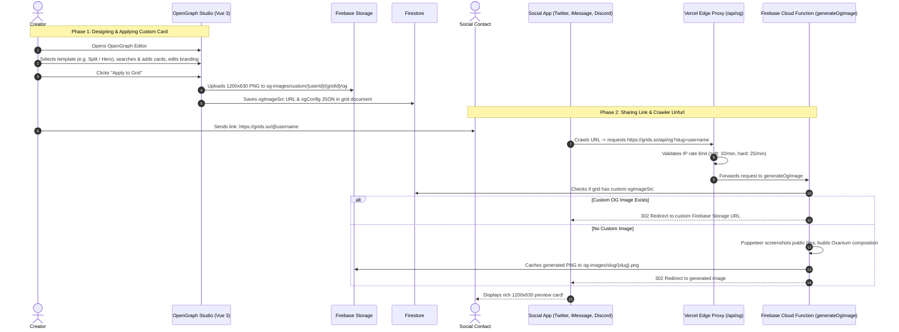

# OpenGraph System & Studio Architecture

This document provides a comprehensive, easy-to-understand reference for how the OpenGraph (OG) system and the in-app **OpenGraph Studio** work across the entire stack — from interactive canvas design in the browser to serverless caching, social crawlers, and link unfurls.

---

## 1. High-Level Overview

### What is OpenGraph?
When a user shares a link to their grid (e.g. `https://grids.so/@username` or `https://grids.so/grid/{gridId}`) on social apps like **Twitter/X, iMessage, Discord, WhatsApp, Slack, or LinkedIn**, the platform's crawler inspects the URL's `<head>` tags:

```html
<meta property="og:title" content="Jane's Creative Portfolio" />
<meta property="og:description" content="Curated links, stories & media" />
<meta property="og:image" content="https://grids.so/api/og?slug=jane&v=1725358900" />
<meta name="twitter:card" content="summary_large_image" />
```

The crawler fetches `og:image` and renders a rich preview card. The standard dimensions are **1200 × 630 pixels** (1.91:1 aspect ratio).

Grids provides two ways this image is created:
1. **Custom OpenGraph Studio (User-Crafted)**: The creator customizes the exact card layout, background, tiles, tilts, and branding inside the app. This takes top priority.
2. **Auto-Generated Fallback**: If the creator hasn't designed a custom card, an automated Cloud Function spins up headless Chromium to screenshot their public tiles and composite an attractive share card on the fly.

---

## 2. End-to-End Flow Diagram



---

## 3. Frontend Architecture: OpenGraph Studio

All editor components live under [`apps/web/src/components/og/`](file:///h:/Grids%20Clone%20Gemini/apps/web/src/components/og):

| File | Role & Responsibility |
|---|---|
| [`OGStudio.vue`](file:///h:/Grids%20Clone%20Gemini/apps/web/src/components/og/OGStudio.vue) | **Studio Orchestrator & Shell**: Manages the top bar, export triggers, mobile view tabs, dialog modals (tour, preview, templates), and the final "Apply to Grid" upload pipeline. |
| [`OGCanvas.vue`](file:///h:/Grids%20Clone%20Gemini/apps/web/src/components/og/OGCanvas.vue) | **1200×630 Canvas Stage**: Renders layered background themes (linear/radial/conic gradients, noise, solid, image), safe-zone branding (left-docked or center-docked), interactive card dragging, rotation, tilt, and motion animations. |
| [`TilePicker.vue`](file:///h:/Grids%20Clone%20Gemini/apps/web/src/components/og/TilePicker.vue) | **Left Sidebar ("Cards & Tiles")**: Includes a sticky Solar search input bar, real-time multi-field card filtering, card count badges, and "+ Add / Placed" controls. |
| [`OGInspector.vue`](file:///h:/Grids%20Clone%20Gemini/apps/web/src/components/og/OGInspector.vue) | **Right Sidebar ("Inspector")**: Controls safe-zone text (custom title, subtitle, initials with pencil popup modal), background controls, tile properties (rotation, dark/light mode toggle, opacity), and unclipped global motion selector with upward popup menu. |
| [`OGSocialPreviewModal.vue`](file:///h:/Grids%20Clone%20Gemini/apps/web/src/components/og/OGSocialPreviewModal.vue) | **Social Share Mockup**: Accurately simulates link unfurls across Twitter/X, iMessage, Discord, and WhatsApp using Solar SVG vector icons with live snapshot refresh. |
| [`OGTemplateModal.vue`](file:///h:/Grids%20Clone%20Gemini/apps/web/src/components/og/OGTemplateModal.vue) | **Template Selector**: Modal showcasing curated visual presets (Split Minimalist, Hero Showcase, Center Stage, Gallery Showcase, Orbits). |
| [`OGTourModal.vue`](file:///h:/Grids%20Clone%20Gemini/apps/web/src/components/og/OGTourModal.vue) | **First-Time Onboarding Tour**: Visually appealing hero card illustration with Solar badge icons guiding new creators. |

---

## 4. Composables & Layout Utilities

### 1. `ogTemplates.ts` (Smart Geometric Layout Engine)
Located at [`apps/web/src/utils/ogTemplates.ts`](file:///h:/Grids%20Clone%20Gemini/apps/web/src/utils/ogTemplates.ts).

**How it handles grids with 14+ tiles**:
- When a user has many tiles (e.g. 14+), templates intentionally curate the top **3 to 5 cards** to prevent the preview card from becoming an overcrowded, unreadable mess.
- **Strict Capacity Limits**:
  - `split`: Exactly 4 cards arranged in a 2×2 right-side grid.
  - `hero`: 1 prominent featured card (scale 1.15) + up to 2 secondary accent cards (scale 0.85).
  - `center`: Exactly 4 cards symmetrically balanced in the left and right wings.
  - `gallery`: Up to 5 cards in a horizontal showcase row.
  - `orbits`: Up to 5 cards orbiting around the central safezone with gentle natural tilts.
- **Non-Overlapping Guarantee**: Eliminates modulo stacking (`i % positions.length`) so no cards ever share identical coordinates. Unplaced tiles remain easily accessible in the left sidebar to swap or add.

### 2. Card Dimension Normalization (`OGCanvas.vue`)
To prevent large multi-unit tiles (e.g. 4x2 or 4x4) from growing to 500+ pixels and bleeding off stage boundaries:
```ts
const rawWFactor = tile?.w ? tile.w / 2 : 1;
const rawHFactor = tile?.h ? tile.h / 2 : 1;
// Bounded growth: scales gently rather than doubling/tripling
const widthFactor = Math.min(1.35, Math.max(0.85, 0.85 + (rawWFactor - 1) * 0.35));
const heightFactor = Math.min(1.3, Math.max(0.85, 0.85 + (rawHFactor - 1) * 0.3));

const baseW = 180 * widthFactor;
const baseH = 160 * heightFactor;
const scale = Math.min(1.25, Math.max(0.7, placement.scale || 1));
```
Result: All cards are clamped between **150px and 240px wide**, fitting cleanly on the 1200×630 stage with generous margins.

### 3. `OgImageUtils.ts` (Storage & URL Routing)
Located at [`apps/web/src/utils/OgImageUtils.ts`](file:///h:/Grids%20Clone%20Gemini/apps/web/src/utils/OgImageUtils.ts).
- `customOgImagePath(userId, gridId)`: Resolves to `og-images/custom/{userId}/{gridId}/og`.
  - **Fixed Path**: Overwritten on every re-upload so orphaned files never pile up.
  - **Quota-Exempt**: Placed under `og-images/` rather than `users/` so it does not count against the creator's upload storage quota.
- `withVersionParam(url, version)`: Appends `?v={Date.now()}` to bust social platform CDN caches (e.g. Twitter and Discord image scrapers).

---

## 5. Backend & Serverless Infrastructure

### 1. Vercel Edge Proxy (`apps/web/api/og.ts`)
Social crawlers send requests to `https://grids.so/api/og?slug=...` or `https://grids.so/api/og?gridId=...`.
- **Two-Tier In-Memory Rate Limiting**:
  - Soft limit (>10 req / 60 s): Returns HTTP 429 with `Retry-After: 60`.
  - Hard limit (>25 req / 60 s): Returns HTTP 429 with `Retry-After: 3600` and a 2-second tarpit delay, blocking the IP for 1 hour.
- **CORS Protection**: Responds with `Access-Control-Allow-Origin: *` so the app's in-browser preview modal can test images from any local or staging origin.

### 2. Firebase Cloud Function (`onRequest_generateOgImage.ts`)
Located in [`apps/firebase-functions/src/storage/onRequest_generateOgImage.ts`](file:///h:/Grids%20Clone%20Gemini/apps/firebase-functions/src/storage/onRequest_generateOgImage.ts).
- **Step 0: Custom Image Short-Circuit**:
  Checks the Firestore grid document. If `ogImageSrc` exists (created via OpenGraph Studio), it **instantly 302-redirects** to that pre-rendered Firebase Storage URL with zero cold-start delay.
- **Step 1: Automated Fallback**:
  If no custom image exists, it launches headless Chromium via Puppeteer:
  1. Queries public grid tiles from Firestore.
  2. Builds an HTML composition styled with Oxanium and Nunito Sans brand fonts.
  3. Uses deterministic seeding to scatter tiles pleasantly around the center branding.
  4. Takes a 1200×630 viewport screenshot.
  5. Caches the result in Firebase Storage (`og-images/slug/{slug}.png`) and 302-redirects the crawler there.

---

## 6. Design System & Iconography Standards

- **Solar Icon System**: All icons follow the Solar Icon specification (`viewBox="0 0 24 24"`, `stroke-width="1.5"` or `1.8`, `stroke-linecap="round"`).
- **Zero Emojis Policy**: Replaced all raw unicode emojis (`𝕏`, `💬`, `🎮`, `📱`, `🎨`, `📦`, `⚙️`, `📐`) across modal tabs, navigation items, and banners with crisp vector SVG components:
  - Twitter/X: Official clean vector glyph
  - iMessage: Solar [`ChatIcon.vue`](file:///h:/Grids%20Clone%20Gemini/apps/web/src/components/icons/ChatIcon.vue)
  - Discord: Official [`DiscordIcon.vue`](file:///h:/Grids%20Clone%20Gemini/apps/web/src/components/icons/DiscordIcon.vue)
  - WhatsApp: Solar message bubble vector
  - Settings & Folders: Solar [`GearIcon.vue`](file:///h:/Grids%20Clone%20Gemini/apps/web/src/components/icons/GearIcon.vue) & [`FolderIcon.vue`](file:///h:/Grids%20Clone%20Gemini/apps/web/src/components/icons/FolderIcon.vue)

---

## 7. Quick Reference: File Directory Map

```text
apps/
|-- web/
|   |-- api/
|   |   `-- og.ts                               # Vercel Edge rate-limiting proxy
|   `-- src/
|       |-- components/
|       |   `-- og/
|       |       |-- OGStudio.vue                # Main editor shell & upload logic
|       |       |-- OGCanvas.vue                # 1200x630 stage & card normalization
|       |       |-- TilePicker.vue              # Cards sidebar with Solar search
|       |       |-- OGInspector.vue             # Settings sidebar & upward motion menu
|       |       |-- OGSocialPreviewModal.vue    # Multi-platform preview simulator
|       |       |-- OGTemplateModal.vue         # Layout presets modal
|       |       `-- OGTourModal.vue             # Onboarding tour modal
|       |-- composables/
|       |   |-- useOGConfig.ts                  # Reactive state & localStorage save
|       |   `-- useOGExport.ts                  # Canvas rasterization & blob export
|       `-- utils/
|           |-- ogTemplates.ts                  # Capacity-limited layout math
|           `-- OgImageUtils.ts                 # Storage path & versioning helpers
`-- firebase-functions/
    `-- src/
        `-- storage/
            `-- onRequest_generateOgImage.ts    # Cloud Function (custom check + Puppeteer fallback)
```
